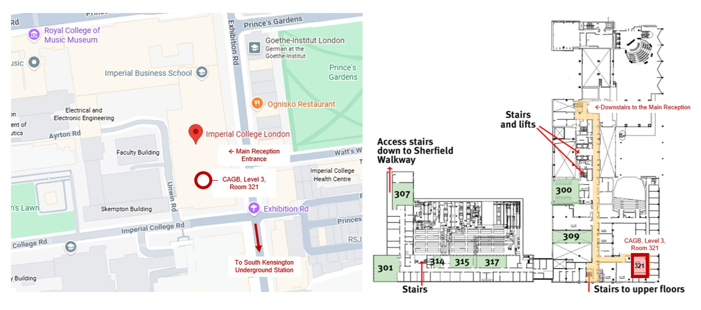

# Imperial College London Christian Postgraduate Group (ICPG)
 

## Leader: Dr Tafara Estelle Makuni
 
Dr Tafara Estelle Makuni is Christian scientist currently pursuing a second AI-focused PhD at Imperial College London within the Structural Integrity and Health Monitoring Group, funded by CINEA and UKRI. She previously completed a PhD in Experimental Aerodynamics at University of Cambridge. With experience across academia, education and industry, including Rolls-Royce and MBDA UK, Tafara combines technical expertise with strong leadership, communication and problem-solving skills.  

Contact: t.makuni23@i******l.ac.uk  
Mobile: (+44)7794 513150

### Co-Leaders: Nancy
  
Fangyue (aka Nancy) is a trainee surgeon and a PhD researcher at Institute of Global Health Innovation at Imperial. She was born in China, and has been exploring the Christian faith ever since university times, until Jesus came and touched her heart when she first became a doctor in 2019. She loves music and has a faith-based Instagram channel @thegracefuldoctor.  
 
Contact: fangyue.chen20@i******l.ac.uk  

### Co-Leaders: Baxter
  
Short Biography.  
 
Contact: baxtermcrolston@chelsea******.org  

## Gathering
#### Location
[Location: CAGB-03-321, City and Guilds Building, Level 3, Meeting Room 321; Imperial College London, South Kensington.](https://www.imperial.ac.uk/engineering/study/current/teaching-spaces/cagb-309/)  
  
#### Dates
+ Thu 1st October 2026: Freshers Welcome Event. Location: CAGB-03-321.  
+ Thu 8th October 2026: Session 1. Location: CAGB-03-321.  
+ Fri 16th October 2026: Guest Speaker. **Location: Christ Church Kensington, Victoria Rd; London W8 5RQ.**  
+ Thu 22nd October 2026: Session 2. Location: CAGB-03-321.  
+ Thu 5th November 2026: Session 3. Location: CAGB-03-321.  
+ Thu 12th November 2026: Session 4. Location: CAGB-03-321.  
+ Fri 20th November 2026: Guest Speaker. **Location: Christ Church Kensington, Victoria Rd; London W8 5RQ.**  
+ Thu 3rd December 2026: : Session 5. Location: CAGB-03-321.  
+ Thu 10th December 2026. Session 6. Location: CAGB-03-321.  

### Other Events
+ [Fruitful Work: Book Launch, Tuesday 22nd September 2026](https://fruitfulwork.org/book-launch) 
+ [Rowan Williams: Releasing the Spirit, 2pm Saturday 26th September 2026](https://www.eventbrite.co.uk/e/releasing-the-spirit-lancelot-andrewes-and-the-poetics-of-preaching-tickets-1995969744235?aff=oddtdtcreator&keep_tld=true)
+ [Forming A Christian Mind: London Seminar, Wednesday 7th October 2026](https://formingachristianmind.org/london/) 
+ [Fruitful Work: National Gathering, Fri/Sat 8-9th January 2027](https://fruitfulwork.org/national-gathering)  

### Additional Resources
#### Talks
+ [Talk: Should Christian Scientists Fear AI? by Dr Tafara E. Makuni](https://youtu.be/TV1cMX5hWok) 

#### Sermons
+ [Sermon: 31/08/25. Christ as an Unblemished Bride by Dr Tafara E. Makuni](https://youtu.be/G5tOrx_P4yg) 
+ [Sermon: 30/11/25. Awaiting the Return of Jesus by Dr Tafara E. Makuni](https://youtu.be/Iv_bYdA8KVA) 
+ [Sermon: 15/03/26. The Courage to Trust God by Dr Tafara E. Makuni](https://youtu.be/sUp9-YSXRmo) 
+ [Sermon: 19/07/26. Living as Wheat amongst the Weeds by Dr Tafara E. Makuni](https://youtu.be/d30FUbPpX9Y) 
+ [Sermon: 23/08/26. The Bedrock of Jesus Christ by Dr Tafara E. Makuni](https://youtu.be/xVD0NwoB1P4) 

## Social Media
+ [Instagram](https://www.instagram.com/imperialchristianpostgradgroup) 
+ [WhatsApp](https://chat.whatsapp.com/FvUIcdLEQlWBBeof7dLWkB) 

## Affiliated Churches and Organisations
+ [Christ Church Kensington](https://www.christchurchkensington.com/) 
+ [St Luke's Christ Church Chelsea](https://chelseaparish.org/) 
+ [All Saints Goodmayes](https://allsaintsgoodmayes.org.uk/) 
+ [Imperial College Christian Union](https://imperialcollegechristianunion.com/) 
+ [Forming A Christian Mind](https://formingachristianmind.org/) 
+ [Fruitful Work](https://fruitfulwork.org/) 
